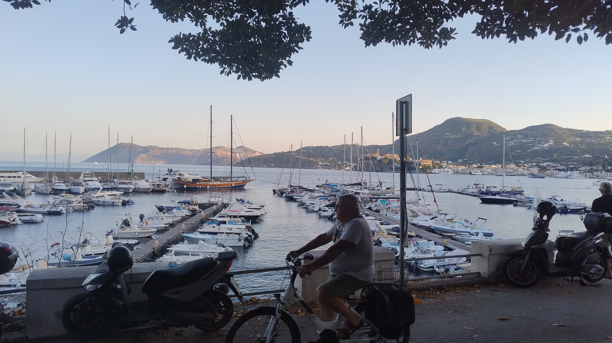
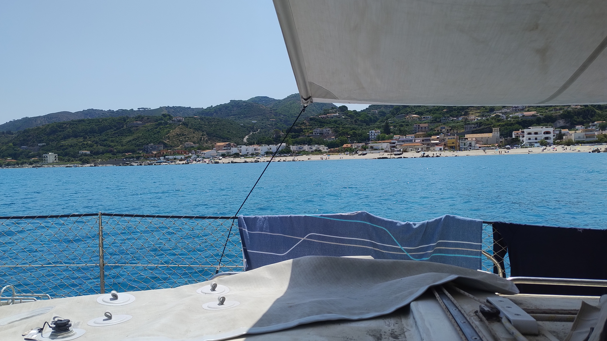
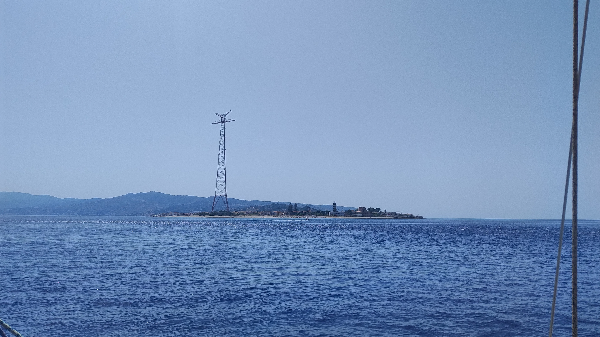

# Woche 2 von Olbia nach Messina

Ich frage moch zwischendurch, ob dieser Blog mehr ein digitales Logbuch oder ein Reisetagebuch sein soll.

Die Fahrt von Olbia nach Budoni verlief ereignislos. Wir entschieden uns den Weg durch die Inseln vor Olbia zu fahren. Das erforderte Aufmerksamkeit vom Navigator, der Kiruna trotz der Hitze sicher ans Ziel brachte.

Das Ziel hatte es in sich. Die breite Bucht bot einen perfekten Halt für den Anker und wenn man das Schiff abtauchte, sah es fast so aus, als würde es in der Luft schweben.

Wir assen dort mit einem Gast, den wir an Land abholten (das Dinghy hat super funktioniert).

Am nächsten Morgen versuchten wir noch erfolglos Gas aufzutreiben. Leider gab es die richtige Flasche nirgends. Später stellte sich heraus, dass wir noch genug Gas gehabt hätten, aber ein Gashahn musste durch ein Versehen geschlossen worden sein.

Schliesslich legten wir ab. Irgendwie würde es schon gehen. Zwei Tage und zwei Nächte waren wir unzerwegs um die rund 270 Seemeilen zurückzulegen. Es gab neben dem Gas nicht ein grösseres Problem.

Nur beim einlaufen in diesen Hafen ist noch der Bugstrahler ausgestiegen. Zum Glück war es nur eine Sicherung, die wieder eingeschaltet werden konnte.

Lipari war ein sehr schöner Halt und wir wurden selten so freundlich empfangen. 

 

Anschliessend sind wir nach Vulcano gesegelt, wo wir einen kurzen Badestop machten, bevor es weiter bis nach Sizilien ging. Dort durften wir wieder an einem sehr schönen Strand ankern, der uns an den Strand in Budoni erinnerte.

 

Schliesslich ging es noch die restlichen 15 Seemeilen nach Messina. Die Strömung in Kombination mit Rückenwind machte das Vorwärtskommen einfach.

 

Die einzige Marina in Messina ist recht einfach (wenn man vom Restaurant mit Michelin Stern darin absieht). Leider sind es nur Schwimmstege, weshalb die nacht mit aufkommenden Winden und vorbeifahrenden Fähren recht rollig war.

Bald geht es aber schon weiter nach Split, wenn die Crew endlich eintrifft. Ich wusste nicht, dass die Züge in Italien auch so unzuverlässig sein können.
